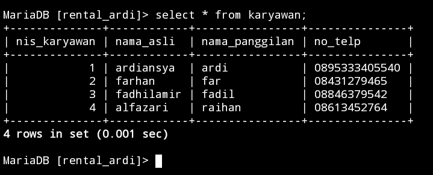
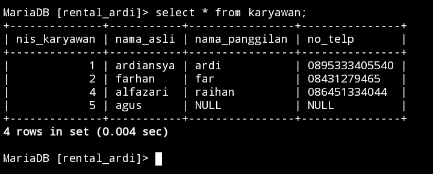
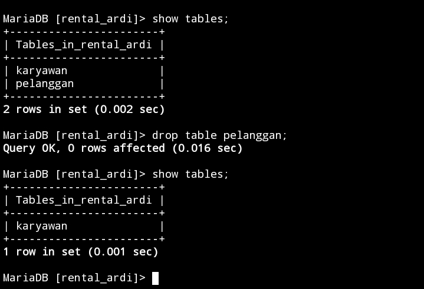

# Instalasi MysQL

## Menggunakan termux

1. Buka Aplikasi Termux
2. Ketik "termux-setup-storage"
3. Ketik izinkan/allow access
4. Lakukan update atau upgrade paket. Ketik "pkg update && upgrade -y"
5. jika ada informasi untuk melanjutkan instalasi ketik "y"
6. Hasil aplikasi mariadb dengan mengetik "pkg install mariadb"
7. Ketika proses berhenti dan ada pilihan "y/n" ketik saja "y" untuk melanjutkan proses penginstalan
8. ketik "mysqld_safe" untuk memberi keamanan.
9. Ketik CNTRL+Z agar bisa ngesave datanya.
## Referensi Link Vidio YouTube 

https://youtu.be/dmhJQ4zs_WY?si=yLCNgx8ZNHbEbFDx
# Penggunaan Awal MySQL
## QUERY

Perintah `mysql -u root` digunakan untuk masuk ke client MySQL dengan menggunakan nama pengguna "root". Ini akan memungkinkan Anda untuk terhubung ke server MySQL dan mengeksekusi perintah SQL atau mengelola basis data yang terhubung dengan akun "root".

## HASIL

![[mysql_-u_root.jpg]]

## ANALISIS


# Insert
## Insert 1 Data
### Struktur

```mysql
insert into nama_table
    values ("nilai1","nilai2","nilai3","nilai4");
```

### Contoh

```mysql
insert into karyawan
     values ("1","ardiansya","ardi","0895333405540");
```

### Hasil


### Analisis 

- `INSERT INTO karyawan` : Ini menentukan nama tabel dimana data akan dimasukkan, dalam hal ini, "karyawan".

- `VALUES ("1", "ardiansya", "ardi", "0895333405540")`: Ini menentukan nilai yang akan dimasukkan ke dalam setiap kolom tabel. Nilai yang diberikan adalah untuk kolom sesuai urutan kemunculannya di tabel.

- "1" untuk kolom pertama,
- "ardiansya" untuk kolom kedua,
- "ardi" untuk kolom ketiga,
- "0895333405540" untuk kolom keempat.

Akan menyisipkan baris baru ke dalam tabel "karyawan" dengan nilai yang ditentukan.

### Kesimpulan 

Kesimpulan dari perintah `INSERT INTO karyawan VALUES ("1", "ardiansya", "ardi", "0895333405540");` adalah data karyawan dengan ID 1, nama "ardiansya", nama panggilan "ardi", dan nomor telepon "0895333405540" telah dimasukkan ke dalam tabel karyawan.

## Insert >1 Data
### Struktur

```mysql
insert into nama_table 
     values ("nilai1","nilai2","nilai3","nilai4"),
("nilai1","nilai2","nilai3","nilai4"),
("nilai1","nilai2","nilai3","nilai4");
```

### Contoh

```mysql
insert into karyawan
    values ("2","farhan","far","08431279465"),
("3","fadhilamir","fadil","08846379542"),
("4","alfazari","raihan","08613452764");
```

### Hasil



### Analisis

- Perintah: `INSERT INTO karyawan`
- Data yang dimasukkan:
  - Set 1: ("2654", "farhan", "far", "089753627153")
  - Set 2: ("2541", "raihan", "han", "08527383654")
  - Set 3: ("2331", "fadhil", "fadil", "08964321759")
- Tabel Tujuan: `karyawan`
- Kolom yang diisi:
  - `id_karyawan`: Nilai dari kolom ini adalah "2654", "2541", dan "2331" untuk masing-masing set data.
  - `nama_depan`: Nilai dari kolom ini adalah "farhan", "raihan", dan "fadhil" untuk masing-masing set data.
  - `nama_belakang`: Nilai dari kolom ini adalah "far", "han", dan "fadil" untuk masing-masing set data.
  - `no_telepon`: Nilai dari kolom ini adalah "089753627153", "08527383654", dan "08964321759" untuk masing-masing set data.

### Kesimpulan

Adalah bahwa query tersebut berhasil memasukkan tiga baris data baru ke dalam tabel karyawan dengan informasi yang terperinci mengenai setiap karyawan, termasuk ID, nama depan, nama belakang, dan nomor telepon mereka.

## Menyebut Kolom
### Struktur 

```mysql
insert into nama_table
    (kolom1,kolom2) values ("nilai1","nilai2");
```
### Contoh

```mysql
insert into karyawan
(nama_asli,nis_karyawan) values ("agus","5");
```

### Hasil

![[menyebut_kolom.jpg]]

### Analisis

- `INSERT INTO karyawan`: Ini adalah pernyataan SQL yang menunjukkan bahwa kita ingin menyisipkan data ke dalam tabel bernama `karyawan`.

- `(nama_asli, nis_karyawan)`: Bagian ini menentukan kolom-kolom di mana data akan dimasukkan. Dalam hal ini, kolom yang ditentukan adalah `nama_asli` dan `nis_karyawan`.

- `VALUES ("agus", "5")`: Ini adalah nilai yang ingin dimasukkan ke dalam kolom yang telah ditentukan sebelumnya. `"agus"` akan dimasukkan ke dalam kolom `nama_asli`, dan `"5"` akan dimasukkan ke dalam kolom `nis_karyawan`.

Jadi, secara keseluruhan, query ini akan menambahkan sebuah baris baru ke dalam tabel `karyawan` dengan nilai `"agus"` untuk kolom `nama_asli` dan nilai `"5"` untuk kolom `nis_karyawan`.

### Kesimpulan

Query ini merupakan sebuah perintah SQL untuk memasukkan data baru ke dalam tabel `karyawan`. Data yang dimasukkan adalah nama_asli "agus" dan nis_karyawan "5".

# Update (data)
## Struktur 

```mysql
update nama_tabel set nama_kolom1"nilai1" where nama_kolom2"nilai2;
```

## Contoh 

```mysql
update karyawan set no_telp="086451334044" where nis_karyawan="4";
```

## Hasil


## Analisis 

- `UPDATE karyawan`: Bagian ini menentukan tabel yang akan diperbarui, yaitu "karyawan" dalam hal ini.

- `SET no_telp="086451334044"`: Bagian ini menetapkan nilai kolom "no_telp" menjadi "086451334044" untuk record yang sesuai dengan kondisi yang ditentukan pada klausa WHERE.

- `WHERE nis_karyawan="4"`: Bagian ini menentukan kondisi yang harus dipenuhi oleh catatan agar dapat diperbarui. Dalam hal ini, memperbarui record dimana nilai pada kolom "nis_karyawan" sama dengan "4".

## Kesimpulan 

sebuah perintah SQL untuk mengubah nilai kolom nama_asli menjadi "ardiansya" di dalam tabel karyawan dimana nis_karyawan memiliki nilai "4". Kesimpulannya, perintah tersebut bertujuan untuk memperbarui data karyawan dengan nis_karyawan tertentu dengan no_telp "086451334044".

# Delete (Hapus baris data)
## Struktur

```mysql
DELETE FROM nama_tabel WHERE nama_kolom"nilai";
```

## Contoh

```mysql
DELETE FROM karyawan WHERE nis_karyawan="3";
```

## Hasil



## Analisis

**Perintah:** `DELETE FROM karyawan`
- Ini adalah perintah untuk menghapus data dari tabel "karyawan".

**Kondisi WHERE:** `nis_karyawan=3
- Ini adalah klausa WHERE yang menentukan kriteria untuk baris-baris yang akan dihapus. Dalam hal ini, baris akan dihapus jika nilai kolom "nis_karyawan" sama dengan 3.

**Tabel:** `karyawan`
- Ini adalah nama tabel yang akan dihapus barisnya.

## Kesimpulan

Perintah SQL di atas menghapus baris data dari tabel "karyawan" di mana nilai kolom "nis_karyawan" sama dengan "3". Kesimpulannya, program ini digunakan untuk menghapus informasi karyawan dengan nomor identitas "3" dari basis data.

# Hapus Tabel
## Struktur

```mysql
drop table nama_table;
```

## Contoh

```mysql
drop table pelanggan;
```

## Hasil



## Analisis 

"drop table pelanggan;" adalah tentang perintah SQL untuk menghapus tabel bernama "pelanggan" dari database. 

1. **Drop Table**: Ini adalah perintah SQL yang digunakan untuk menghapus tabel dari database.
  
2. **Pelanggan**: Ini adalah nama tabel yang akan dihapus.

Jadi, secara keseluruhan, query tersebut akan menghapus tabel bernama "pelanggan" dari database yang sedang digunakan. Dengan melakukan ini, semua data yang ada dalam tabel tersebut akan dihapus dan struktur tabelnya akan dihapus dari database.

## Kesimpulan 

Query "DROP TABLE pelanggan;" akan menghapus tabel bernama "pelanggan" dari database. Ini adalah perintah SQL yang digunakan untuk menghapus tabel beserta semua data yang terkait dengan tabel tersebut dari database. Proses ini bersifat permanen, artinya setelah tabel dihapus, data yang ada di dalamnya tidak dapat dikembalikan lagi kecuali jika backup telah dibuat sebelumnya.
